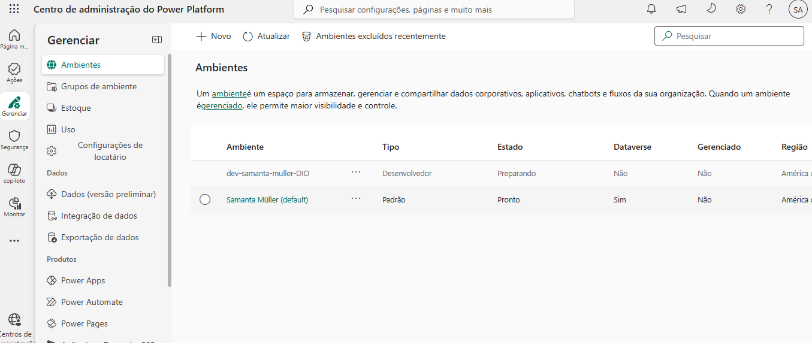
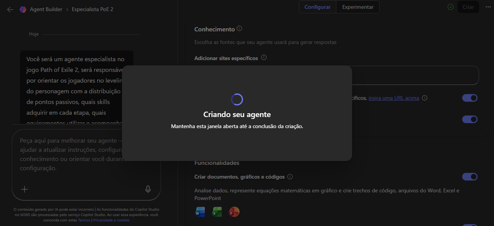
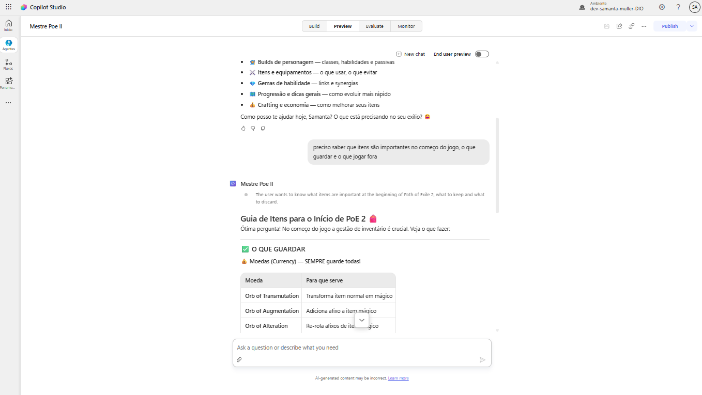
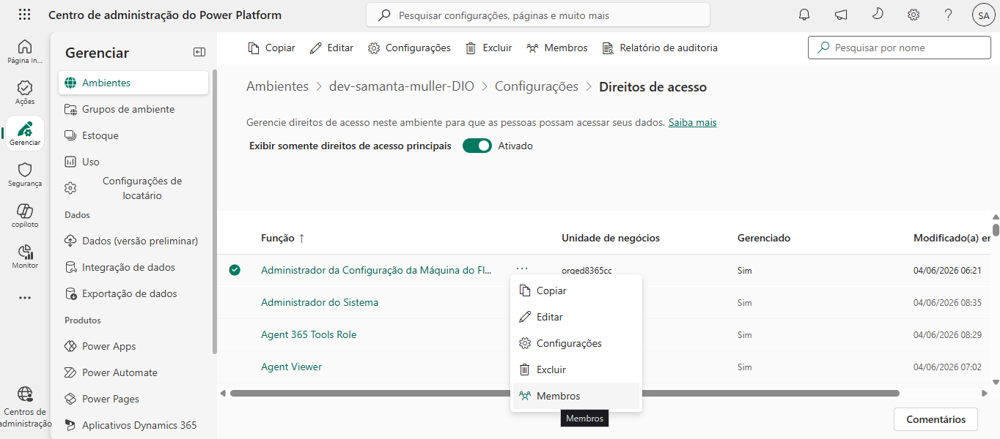

# DIO Criando Ambientes e Agentes com Microsoft Power Plataform
Este repositório contêm informações sobre o que aprendi sobre Microsoft Copilot Studio e Microsoft Power Plataform na trilha de conhecimento da Suzano pela DIO
## O que eu aprendi com o curso?
  - Criar uma conta Microsoft 365
  - Criar uma conta Microsoft Power Plataform
  - Configurar ambientes
  - Criar um novo agente, baseado ou não em um modelo pronto
  - Publicar este novo agente
  - Gerenciar acessos e permissões no ambiente

## Veja algumas capturas de tela do processo:

